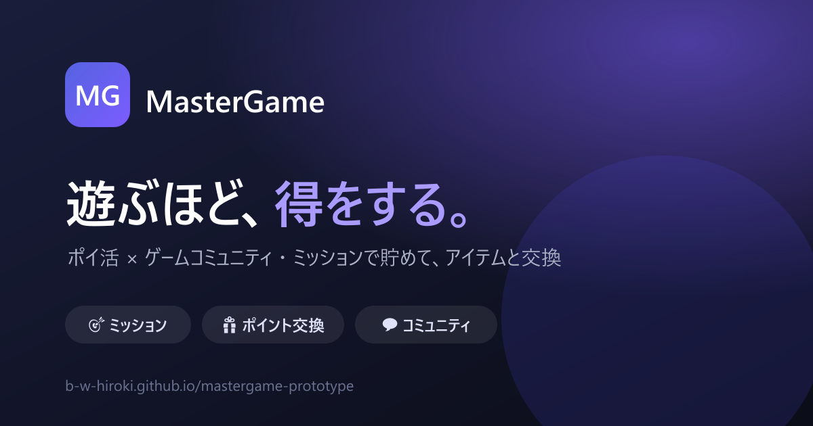

# MasterGame — プロトタイプ



> **ポイ活 × ゲームコミュニティ** プラットフォーム。遊ぶ・助け合う・活動するほど“得”になる世界を。
> 運営：株式会社クリティカルヒット

ミッションでポイントを貯め、提携ゲームのアイテムや実物報酬と交換できるサービスの **動作プロトタイプ**（ワイヤーフレーム）です。アプリ・集客LP・運営管理画面の3つを、ブラウザ上で実際に操作して確認できます。

## 🔗 ライブデモ（GitHub Pages）

**▶ https://b-w-hiroki.github.io/mastergame-prototype/**

上記ハブから各プロトタイプを開けます。個別URL：

| プロトタイプ | 対象 | URL |
|---|---|---|
| 📱 アプリ（コアフロー） | ユーザー | [/wireframes/core-flow.html](https://b-w-hiroki.github.io/mastergame-prototype/wireframes/core-flow.html) |
| 🖥 集客ランディングページ | 獲得 | [/wireframes/landing.html](https://b-w-hiroki.github.io/mastergame-prototype/wireframes/landing.html) |
| ⚙️ 運営コンソール（管理画面） | 運営 | [/wireframes/admin.html](https://b-w-hiroki.github.io/mastergame-prototype/wireframes/admin.html) |

## サービス概要

ユーザーは「ミッション」（記事を読む・公式Xを見る・ゲーム関連アクション等）でポイントを貯め、提携ゲームのアイテムや実物報酬と交換します。ゲーム会社は、無償の誘導枠でのユーザー獲得・非課金ユーザーのマネタイズ・継続率向上を得られます。コミュニティは RPG のギルドをメタファーに、フォーラム（箱）／チャット（会話）／トピック（依頼）で相互互助を促します。

## プロトタイプの見どころ

### 📱 アプリ（`wireframes/core-flow.html`）
- スプラッシュ → **オンボーディング**（4枚）→ **好きなジャンル選択**（パーソナライズ）→ ログイン
- 新規アカウント作成 / パスワード再設定
- ホーム（残高・ニュース・**スマートナッジ**「あと◯P」）
- ミッション（デイリー/ウィークリー/実績/期間限定 ＋ **提携オファー**：オファーウォール/動画リワード）
- **postback検証**：オファー達成が「検証中 → 確定」で反映
- ポイント（**ポイント推移グラフ** ＋ **ステーキング**＝保有ボーナス）
- コミュニティ（ギルド → トピック → 返信／ポイント賭け質問のベストアンサー進呈／通報）
- マイページ（**VIPランク**：ブロンズ→ダイヤ＋バフ／好きなジャンル／設定）

### 🖥 集客LP（`wireframes/landing.html`）
- ヒーロー（端末モック）→ 課題共感 → 3ステップ → 機能（**ベント型レイアウト**）→ 数字 → ユーザーの声 → BtoB導線 → FAQ → CTA
- 左下の **A/B 訴求軸スイッチャー**（A お得 / B 無課金 / C 仲間）。`?v=b` 等でも切替可
- レスポンシブ（スマホはハンバーガーメニュー）

### ⚙️ 運営コンソール（`wireframes/admin.html`）
- ダッシュボード（KPI・週次チャート・アクティビティ）
- ユーザー管理（**No列・総ユーザー数・集計KPI**、累計獲得P/交換済みP/保有P の**ソート**、登録日時 時分まで、BAN/凍結/マーキング）
- ミッション・交換アイテムのマスタ管理
- 通報・モデレーション（削除/警告/却下）
- **postback監視**（承認/却下・承認率）

## MVP ロードマップ

| フェーズ | 内容 | 時期想定 |
|---|---|---|
| MVP0 基盤 | 認証・アカウント・基盤 | 〜2025/6 |
| **MVP1 コア** | ミッション → ポイント → 交換 | 2025/6–7 |
| MVP2 コミュニティ | ギルド・通報・賭け質問 | 2025/7–8 |
| MVP3 運用 | 分析・管理・KPI | 2025/8– |

本プロトタイプは主に **MVP1** のコア体験を対象にしています。

## 想定技術スタック

| 領域 | 技術 |
|---|---|
| モバイル | React Native + Expo (TypeScript) |
| バックエンド | Supabase（Auth / Postgres / Realtime / Storage） |
| 通知 | Expo Notifications（FCM / APNs） |
| 管理画面 | Next.js |

詳細は `docs/specs/` の機能仕様書を参照。

## リポジトリ構成

```
.
├── index.html                # プロトタイプ確認ハブ（GitHub Pages の入口）
├── wireframes/               # 動作プロトタイプ（HTML）
│   ├── core-flow.html        # 📱 アプリ
│   ├── landing.html          # 🖥 集客LP
│   └── admin.html            # ⚙️ 運営コンソール
├── supabase/                 # DB スキーマ・RPC・seed（バックエンド実装）
│   ├── config.toml
│   ├── migrations/           # 0001_core … 0007_admin
│   └── seed.sql
├── apps/
│   ├── mobile/               # React Native + Expo（ユーザーアプリ実装足場）
│   └── admin/                # Next.js（運営コンソール実装足場）
├── docs/
│   ├── DEVELOPMENT.md        # 開発ガイド（セットアップ・スキーマ概要）
│   ├── MasterGame_仕様提案_MVP分割.pptx   # 提案デッキ（18枚）
│   ├── build_deck.js                       # デッキ生成スクリプト（pptxgenjs）
│   └── specs/                              # 機能仕様書（Markdown × 4）
└── README.md
```

## 実装（足場）

プロトタイプ検証を経て、想定スタックでの実装足場を用意しています。詳細は **[docs/DEVELOPMENT.md](docs/DEVELOPMENT.md)**。

- `supabase/` … 仕様書のテーブル定義を反映した Postgres スキーマ（RLS・RPC・seed・運営集計ビュー）
- `apps/mobile/` … Expo（認証・ホーム・ミッション付与RPCを最小実装）
- `apps/admin/` … Next.js（ダッシュボード集計を実データ表示）

## ローカルで動かす

各HTMLは単体で動作します（依存なし・インラインCSS/JS）。ブラウザで直接開くか、簡易サーバーで：

```bash
python -m http.server 8000
# → http://localhost:8000/ を開く
```

提案デッキを再生成する場合：

```bash
npm install            # pptxgenjs
node docs/build_deck.js
```

## ステータス

🧪 **プロトタイプ / ワイヤーフレーム** — 画面と導線の検証を目的としています。データはダミー、処理はフロントエンドのモックです。

---

© 2026 株式会社クリティカルヒット / MasterGame
